### GBT FRame 
??? "GBT FRAME"
    
     

    ??? "GBT Header"
        - {width=300 style="display: block; margin: auto;"}
        - gbt_bank_package.vhd
            - 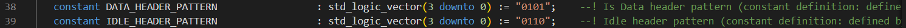{width=600 style="display: block; margin: auto;"}

        ??? RX
            - gbt_rx_decoder.vhd
                - 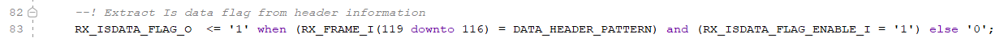{width=600 style="display: block; margin: auto;"}
        ??? TX
            - 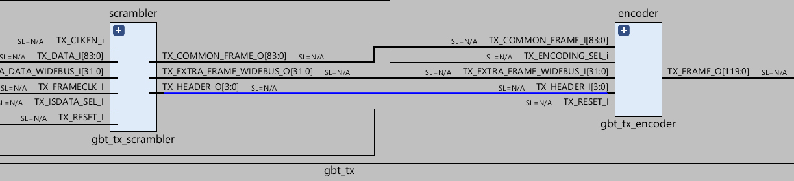{width=600 style="display: block; margin: auto;"}
            - gbt_tx_scrambler.vhd
                - 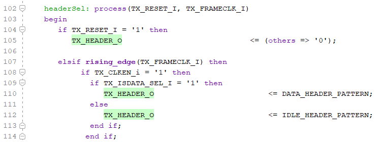{width=600 style="display: block; margin: auto;"}
                - VIO(txIsDataSel_from_user) --- > TX_ISDATA_SEL_I : in  std_logic;
    
    ??? "SC - {IC EC or SWT}" 
        - dfv
        - Есть 3 протокола конфигурауии
        - GBT-EC (External Control) – используется для отправки конфигурационных данных в ASIC (интегральные схемы) на передающей электроник(FEE). - медленный (80 Мбит/с).
        - GBT-IC (Internal Control) – применяется для конфигурирования микросхем GBTx. - медленный (80 Мбит/с).
        - GBT-SWT (Single Word Transfer) – отдельный протокол, не использующий стандартный GBT.
        ??? ICEC 
            

        Зачм нужны
        - Протоколы конфигурации нужны для управления, настройки и мониторинга детекторов в эксперименте ALICE. Они позволяют передавать команды и параметры в электронику переднего края (FEE — Front-End Electronics), чтобы корректно работать с данными, получаемыми от детекторов. Разберём каждый из них подробнее.

    ??? "DATA + isdatasel"
         
        
        
        Физические данные обозначены флагом isdatasel = 1, а управляющие команды (IDLE, SOP, EOP, SWT) имеют флаг isdatasel = 0 и содержат другой заголовок, который хранится в поле данных GBT.
        The CRU extracts the SWT information from the data stream before it reaches the DMA engine
        and stores it in a dedicated FIFO which is accessed by DCS.

        ??? RX
            - gbt_rx_decoder.vhd
                - {width=600 style="display: block; margin: auto;"}
        ??? TX
            - {width=600 style="display: block; margin: auto;"}
            - gbt_tx_scrambler.vhd
                - {width=600 style="display: block; margin: auto;"}
                - VIO(txIsDataSel_from_user) --- > TX_ISDATA_SEL_I : in  std_logic;

??? "GBT_FRAME - WIDE BUS"
    - gbt_bank_package.vhd
        - 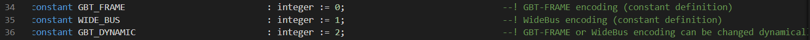{width=600 style="display: block; margin: auto;"}

??? "LATENCY"
    - gbt_bank_package.vhd
        - 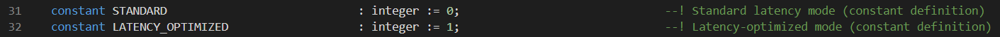{width=600 style="display: block; margin: auto;"}

    - [📄 FIT_Readout_GBT_Finogeev](../ALL_PDF_CERN/FIT_Readout_GBT_Finogeev.pdf)
        - 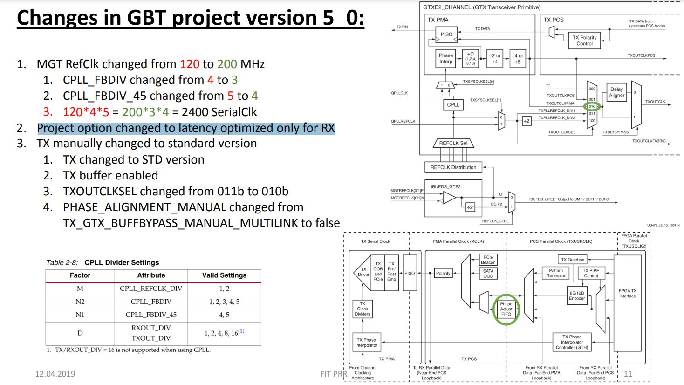{width=600 style="display: block; margin: auto;"}
    
??? Frame detection
    

??? "GBT - CRU"
    ??? "KC-705 -> CRU(ALF) test"
        
        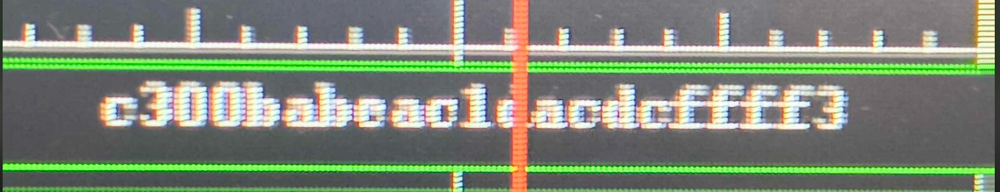
        - разобраться почему мы вдем нули 
        - попробывать высыдать данные счетчиком и посмотреть все ли данные доходят

    ??? "CRU(ALF) -> KC-705 test"
        - Пробывали высылать данные с ALF но на KC-705 было поусто 
        - При обновлении системы (Фринчишек лучше знает что он делал) появлялись какието данные на KC-705ъ
        - Нужно сделать LoopBack что бы понимать что правильно высылаем данные - (приемник работает)
        - В понедельние пойдет листа закупов 

??? Проверка_изминеиня_битов success
    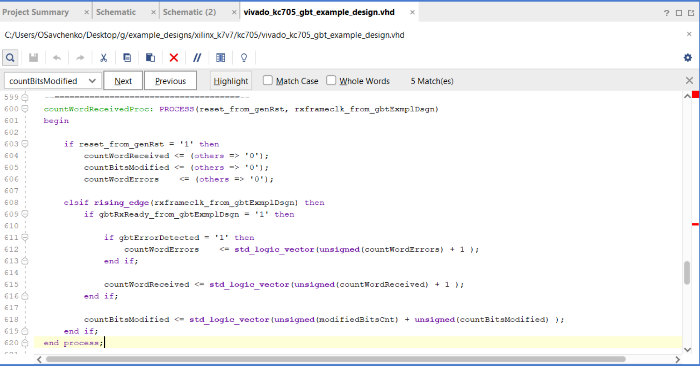
    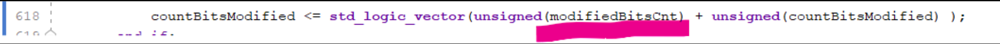
    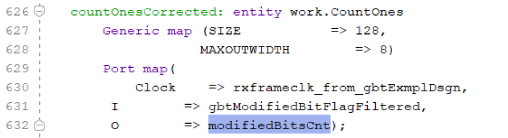

??? fdvfd
    - Как это работает?
    - Детекторы передают данные к CRU (Central Readout Unit).
    - Если isdatasel = 1, передаются физические события.
    - Если isdatasel = 0, CRU определяет управляющие команды по старшим битам данных.
    - CRU извлекает SWT и отправляет его в FIFO, доступный для системы управления DCS.