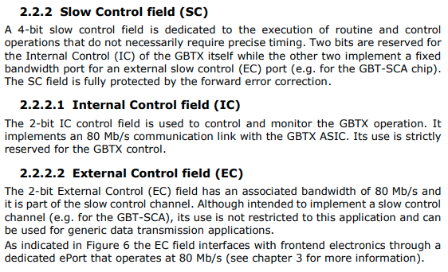

### 🟢 02 - GBT

У нас есть два типа рамек 

 

 

Как это работает?
Детекторы передают данные к CRU (Central Readout Unit).
Если isdatasel = 1, передаются физические события.
Если isdatasel = 0, CRU определяет управляющие команды по старшим битам данных.
CRU извлекает SWT и отправляет его в FIFO, доступный для системы управления DCS.

 
Физические данные обозначены флагом isdatasel = 1, а управляющие команды (IDLE, SOP, EOP, SWT) имеют флаг isdatasel = 0 и содержат другой заголовок, который хранится в поле данных GBT.
The CRU extracts the SWT information from the data stream before it reaches the DMA engine
and stores it in a dedicated FIFO which is accessed by DCS.

??? Header success
     

??? Frame detection
    

??? is data 
    

### 🟢 03 - Slow control

Есть 3 протокола конфигурауии
- GBT-EC (External Control) – используется для отправки конфигурационных данных в ASIC (интегральные схемы) на передающей электроник(FEE). - медленный (80 Мбит/с).
- GBT-IC (Internal Control) – применяется для конфигурирования микросхем GBTx. - медленный (80 Мбит/с).
- GBT-SWT (Single Word Transfer) – отдельный протокол, не использующий стандартный GBT.
??? ICEC 
    

Зачм нужны
 - Протоколы конфигурации нужны для управления, настройки и мониторинга детекторов в эксперименте ALICE. Они позволяют передавать команды и параметры в электронику переднего края (FEE — Front-End Electronics), чтобы корректно работать с данными, получаемыми от детекторов. Разберём каждый из них подробнее.