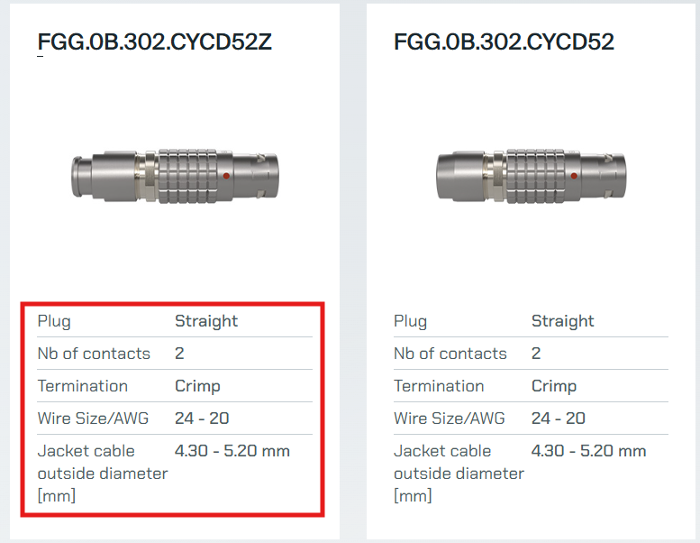

## IP Table 

| **Network - 192.168.88.xx** | **Secondary Network - 172.20.75.xx** |
|---------------------|----------------------|
| FRED - 192.168.88.235 | TCM - 172.20.75.180 |
| ALF - 192.168.88.232 | ALF IPBUS - 172.20.75.100 |
| WinCC - 192.168.88.233 | MOXA - 172.20.75.222 |
| FLP - 192.168.88.236 | FIT IPBUS - 172.20.75.200 |
| FIT - 192.168.88.254 |  |
| LTU - 192.168.88.231 |  |
| WIENER - 192.168.88.234 |  |
| LAB_DCS - 192.168.88.228 |  |
| LAB_FPGA - 192.168.88.226 |  |

## Cables, fiber optics, adapters, etc...

### Lemo 
#### Как выбрать 
[🌐Unipole Multipole catalog](https://web.lemo.com/img/resources/catalog/ROW/UK_English/unipole_multipole.pdf)

[🌐сайт для выбора](https://www.lemo.com/int_en/solutions/originals/b-indoor-keyed/fgg-0b-302-cycd42.html)

??? vdv
    

- CLAD - паять 
- CYCD - зажимать 

С двойным болцем FGG.0B.302.CYCD42

#### Video
[🎬 text](https://www.youtube.com/watch?v=njMTpyLn8PI)
[🎬 text](https://www.youtube.com/watch?v=o9aLQjGjXig)