## IP Table 

| **Network - 192.168.88.xx** | **Secondary Network - 172.20.75.xx** |
|---------------------|----------------------|
| FRED - 192.168.88.235 | TCM - 172.20.75.180 |
| ALF - 192.168.88.232 | ALF IPBUS - 172.20.75.100 |
| WinCC - 192.168.88.233 | MOXA - 172.20.75.222 |
| FLP - 192.168.88.236 | FIT IPBUS - 172.20.75.200 |
| FIT - 192.168.88.254 |  |
| LTU - 192.168.88.231 |  |
| WIENER - 192.168.88.234 |  |
| LAB_DCS - 192.168.88.228 |  |
| LAB_FPGA - 192.168.88.226 |  |

## Fiber optic

??? "Optic fiber connectors"
    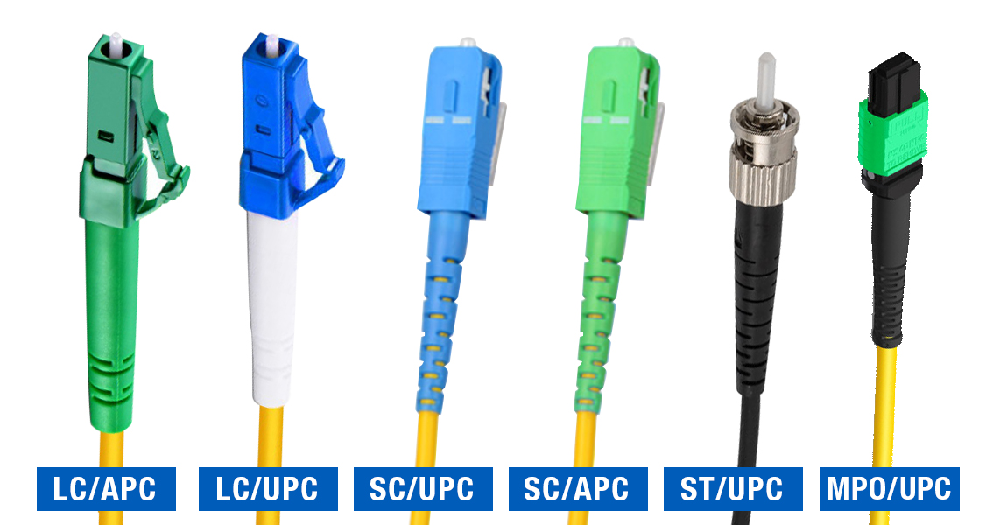
    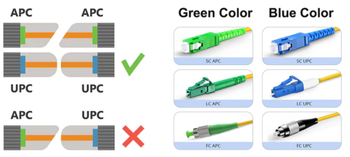
    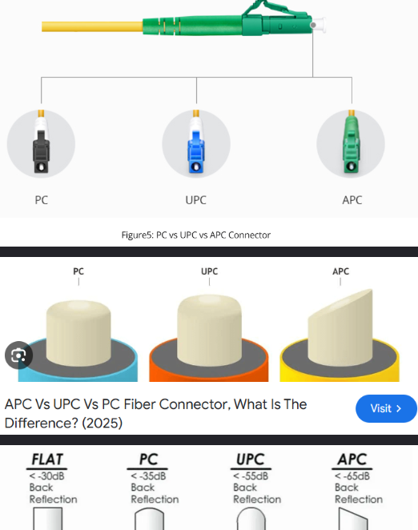

    - PC (Physical Contact) 
    - UPC (Ultra Physical Contact)
    - APC (Angled Physical Contact)

??? "Fiber color code"
    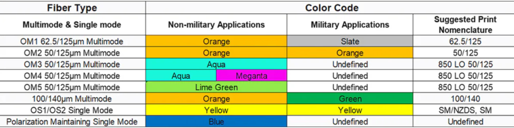
    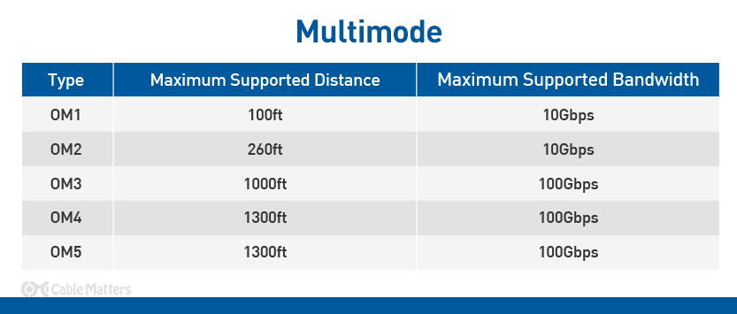

    - OM - multimode 
    - OS - sigle mode
    
    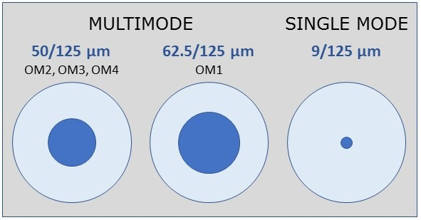{width=600 style="display: block; margin: auto;"}

??? "SFP"
    - ??? "How to understand what wavelength the SFP is designed for?"
        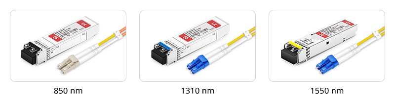{width=600 style="display: block; margin: auto;"}
    - ??? "SFP in Lab"
        - 850 nm, 10G10GBASE-SR, 300m
        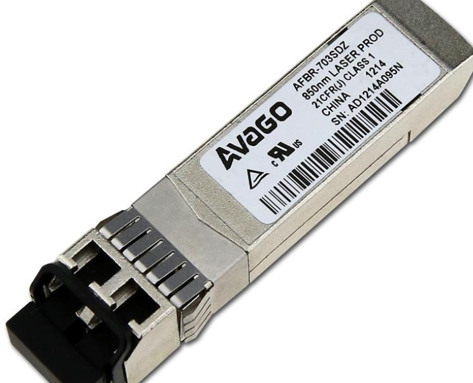{width=600 style="display: block; margin: auto;"}

??? "PON"
    ??? "Theory"
        - 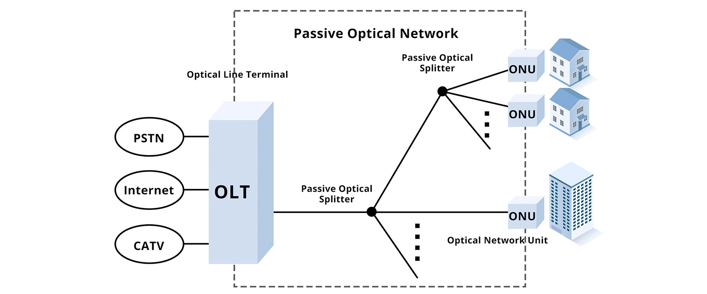{width=600 style="display: block; margin: auto;"}
        - 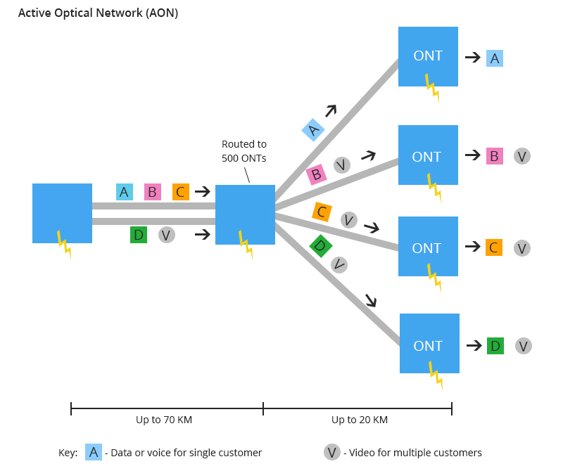{width=600 style="display: block; margin: auto;"}

        - PON Standards
            - EPON, GPON, WDMPON

??? Attenuator warning
    - ToDo

??? Connector warning
    - ToDo

??? Spliter warning
    - ToDo

## Lemo 

??? "Useful links"
    - [📄Unipole Multipole catalog](../ALL_PDF_CERN/unipole_multipole.pdf)
    - [🌐Lemo official website](https://www.lemo.com/int_en/solutions/originals/b-indoor-keyed/fgg-0b-302-cycd42.html)

    - [🎬 LEMO's B series crimped connector assembly - FGG.0B.304.CYCD42](https://www.youtube.com/watch?v=njMTpyLn8PI)
    - [🎬 LEMO's B series connector assembly - FGG.1B.306.CLAD](https://www.youtube.com/watch?v=o9aLQjGjXig)

??? "Example for FGG.0B.302.CYCD42"
    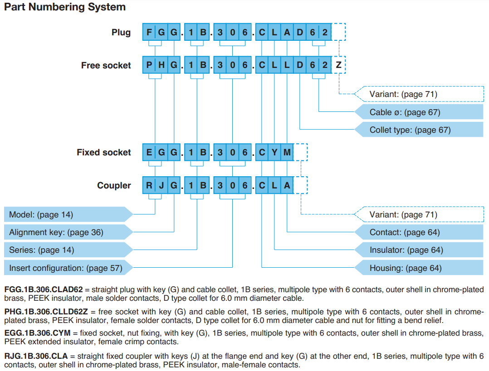

    - FGG - plug type
    - 0B
        - 0 - connector size
        - B Series (indoor, keyed) 
        - K Series (outdoor, keyed)
        - T Series (outdoor, keyed)
        - S Series (indoor, stepped insert)
        - E Series (outdoor, stepped insert)  
    - 302 
        - 2 two pin 
    - CLAD - to solder wires
    - CYCD - to clamp wires
    - 42   - wire size / outside diameter
    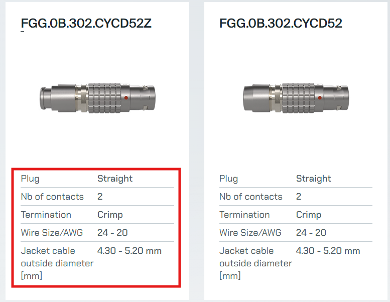

