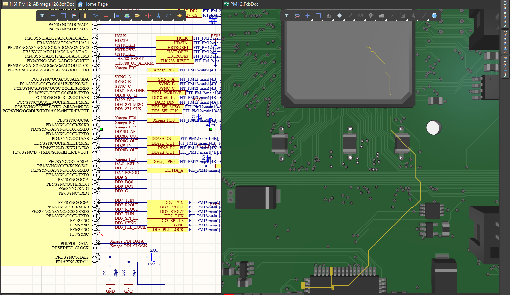

### **Reflection**

??? "When dose we will have one reflection or when dose we have multiply reflection  ?"
    - We will have one reflection if we have missing impedance only from Rx side
        -   [one reflectiont](IMG/ALTIUM/image_2.png)
    - We will have multiply reflection if we have missing impedance from Rx side and Tx sied
        -   [multiply reflectiont 1](IMG/ALTIUM/image_3.png)
        -   [multiply reflectiont 2](IMG/ALTIUM/image_4.png)
        -   [multiply reflectiont 3](IMG/ALTIUM/image_5.png)
    - [Good calculator online for understanding this](https://designertools.app.protoexpress.com/?appid=TXLRCAL&data=ONsTAS5bIR5nFHqIuoQIEqpeYI6FNtC1kNPK9gKk14INuL5nZePBvOxvbHPnk5%20cnHE%20LdwaQf3NPMrsZsHzKD%20%2FM7rjI1AL7TaRuIf%20k%2FaLF5w5yX8NdWEca2p4jr%2Fqd%2F3jiCq2vt109mcdP9itFqb25bcJfU80I08FAEkspybHJoOJbTfc%2FCoK4ZEe1vozrLfjq9Dfs2X42lXYJUnGyJi%20eJFcIvDOZINfUJtZF81UttQPqGh3kPEVQTVWItcA67vr3TNP%20WeEN22%20bXT7AER4Z2z2hsmst3QN4FxVwxvTJQoSn0PzSIu7GDixipPk0cwhm3SBk3Vu9L4HLMaXYQ%3D%3D&q=Sat%20Jan%2025%2010:52:53%20PST%202025)

??? "Reflection coefficient formula"
    - [alt text](IMG/ALTIUM/image_6.png)

## Other
- ??? Навигнация_между_схемой_и_PCB_____Cross_probe
    - 
    - [Cross probe](https://youtu.be/Z-3JruEDlYs?t=44)
    - [Cross probe](https://www.altium.com/ru/documentation/altium-designermanaging-design-changes-between-schematic-pcb#265a899d2fa72a00269bfbd91d6ecc70)

- ??? Sources 
    - [Официальная документация](https://www.altium.com/ru/documentation/altium-designer)
    - Можно найти описание палытных курсов - смотерть их программу и по ихней программе гуглить информацию
        - [курс 1](https://skill-lib.ru/courses)
    - книги