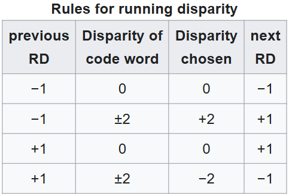

# **Data path**
- ??? Base 
    - ??? TX_data_path_RX_data_path
        | [TX](IMG/RXTX/image_6.png) | [RX](IMG/RXTX/image_7.png) |
## **Encoding**

### **8b/10b Encoding**

??? Base

    ??? Why_is_this_needed 
        - Synchronization:
            - The presence of frequent transitions between 1 and 0 helps the receiver maintain synchronization with the signal, even if the original data contains a long sequence of identical bits.
        - DC balance:
            - Eliminates DC offset in the communication line, which simplifies transmission and reception circuits (no need to worry about transmitting "DC components").
        - Error detection:
            - Some errors can be detected at the encoding level, as incorrect 10-bit sequences can simply be discarded.

    ??? Two_stages 
        - 8b/10b encoding is divided into two stages:
            - 8b/6b encoding: Converts 5-bit data into 6-bit code words.
            - 3b/4b encoding: Converts the remaining 3 bits into 4-bit code words.

#### **Running disparity**

??? Definition 
     
    - In 8b/10b encoding, disparity is the difference between the number of ones (1) and zeros (0) in a codeword.
    {width=300 style="display: block; margin: auto;"}
        - Positive and Negative Disparity
            - Positive disparity (+RD, +2) means that there are more ones (1) than zeros (0) in the codeword.
            - Negative disparity (-RD, -2) means that there are more zeros (0) than ones (1) in the codeword.
        - Zero disparity (0) means that the number of zeros (0) and ones (1) in the codeword is equal.

    - ??? Pos_Neg_Disparity
        - Examples of 10-bit Codes
            - Code with Positive Disparity (+2)
                - 1110101100 (7 ones, 3 zeros → +2)
                - In this word, there are 7 ones and 3 zeros. Therefore, the disparity is +2.
            -  Code with Negative Disparity (-2)
                - 0001010010 (3 ones, 7 zeros → -2)
                - In this word, there are 3 ones and 7 zeros. Therefore, the disparity is -2.
    - ??? How_work
        - The transmitter monitors the accumulated disparity (Running Disparity, RD).
            - If there were more ones before (RD = +1), it selects a code with negative disparity (-2) to bring RD back to -1.
            - If there were more zeros before (RD = -1), it selects a code with positive disparity (+2) to bring RD back to +1.
        - This helps maintain an even distribution of 1s and 0s in the signal.

#### **5b/6b code (abcdei) and 3b/4b code (fghj)**
- [5b/6b code (abcdei)](IMG/RXTX/image_3.png)
- [3b/4b code (fghj)](IMG/RXTX/image_4.png)
    - [Example -> 8b/10b](IMG/RXTX/image_5.png)

#### **K-codes**

K-codes (K-symbols) are special control symbols in 8b/10b encoding that do not represent regular data. They are used for synchronization, data flow control, packet delineation, and other service functions.

- Why are K-symbols needed?
    - In digital transmission, there are usually two types of data:
        - Regular (D-codes, "Data") – These are useful data transmitted in a packet.
        - Control (K-codes, "Control") – These are special symbols that help the transmitter and receiver synchronize
            - [comma image](IMG/RXTX/image.png)

- Why K.28.5?
    - It contains 5 consecutive ones (11111), which do not appear in regular data, making it easy to recognize.
    - This makes it an ideal frame start marker – the receiver immediately sees where a new data packet begins.

??? Example
    - K.28.5 D.5.6 D.16.2 D.4.3 D.10.5 ...
        - K.28.5 → Control character for start of packet
        - D.5.6, D.16.2, D.4.3, D.10.5 → Regular data

    
### **64b/66b Encoding**
- ??? Base
    - Used in 10+ Gbit/s Ethernet (10GBASE-R).
    - Lower overhead (only 3% compared to 25% in 8b/10b).
    - Works similarly like 8b/10b but adds a 2-bit header to a 64-bit block.

### **Using materials**
- [wiki](https://en.wikipedia.org/wiki/8b/10b_encoding)
- [8b/10b Encoding](https://www.youtube.com/watch?v=krCEYzwFZ3s&t=431s)
- [8b/10b Encoding](https://www.youtube.com/watch?v=zGtdsfu_m14)

#### ^^**Other**^^ 
- [adiuvoengineering](https://www.adiuvoengineering.com/post/high-speed-transceivers-in-xilinx-fpgas)

### **Other**
|  |  |
|----------------------------------|----------------------------------|

- 